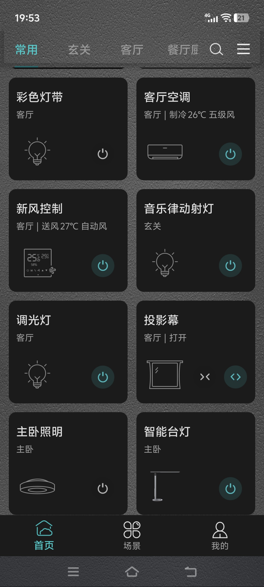
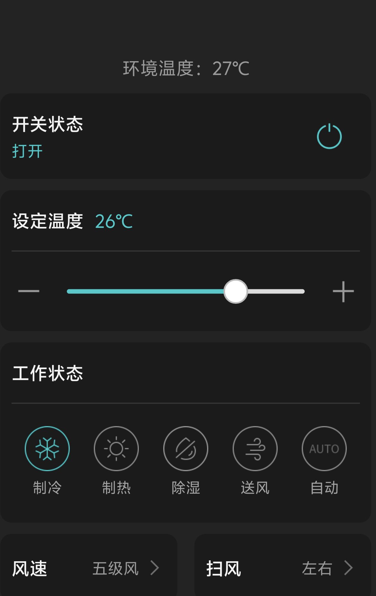

## App 元信息

| 字段 | 值 |
|---|---|
| app_name | smart-home-app |
| display_name | Smart Home |
| domain | Smart Home / Home Automation |
| description | A smart home app for viewing room conditions, controlling devices, and managing home inventory and grocery lists. |
| web_url | https://smart-home.local |

## 锚点 App

| 名称 | URL | 仿制范围 |
|---|---|---|
| Google Home | https://home.google.com/ | 参考智能家居首页、设备卡片、房间状态展示与设备控制入口；不仿制摄像头、语音助手、家庭成员权限等复杂能力。 |

## Feature List

### 房间状态域 (smarthome)

- **查看房间环境概览**：用户在 Smart Home 页面查看当前房间的环境指标概览，包括 temperature、humidity，以及可选的 noise、light、air quality 等信息，且每个指标显示明确名称与单位。
    
    文字描述：Smart Home 页面直接在上方显示当前环境指标，包括 temperature、humidity，并可通过“+”添加额外展示指标（如 noise、light、air quality）。每个指标显示明确名称与单位。下方有多个选项（Thermostat、咖啡机管理、库存管理、待购清单），可以进入不同的功能页面。

### 恒温器控制域 (thermostat)

- **管理恒温器设置**：用户查看 Thermostat 当前 mode 和目标温度，并可将 mode 切换为 comfort、eco 或 off，或调整目标温度（例如 68F），提交后页面展示更新后的设置值。
    
    文字描述：用户在 Smart Home 页面点击 Thermostat 进入 Thermostat 界面。此界面显示当前 mode，并支持切换 mode 为 comfort（默认 71F）、eco（默认 78F）或 off（默认当前温度）。同时支持直接调整目标温度，提交后页面展示更新后的设置值。

### 咖啡机计划任务域 (coffee)

- **管理咖啡机预约启动时间**：用户查看 Coffee Machine 当前预约启动时间，将 start_time 调整为更晚的时间（至少支持延后 20 分钟），并在提交后看到更新后的 start_time。
    文字描述：用户在 Smart Home 页面点击咖啡机管理后进入咖啡机管理界面。此页面可以查看 Coffee Machine 的当前预约启动时间，支持将预约时间修改为更晚的时间（至少支持延后 20 分钟），并在提交后看到更新后的 start_time。

### 库存与购物清单域 (inventory-grocery)

- **管理 Fridge 与 Pantry 库存**：用户进入库存管理页面，分别查看 Fridge 和 Pantry 两个分区中的库存项，并对库存项进行新增、编辑、删除；每条库存项显示 item_name、quantity、unit，以及可选的 expiry_date、category、location 等字段。
    文字描述：用户在 Smart Home 页面点击库存管理后进入库存管理界面。在库存管理页面可分别查看 Fridge 和 Pantry 两个分区中的库存项，并对库存项进行新增、编辑、删除；每条库存项显示 item_name、quantity、unit，以及可选的 expiry_date、category、location 等字段。

- **查看与维护 Grocery List**：用户查看待购清单中的商品条目，并维护每条待购项的 item_name、target_quantity、unit，以及可选的 priority、status 等字段。
    文字描述：用户在 Smart Home 页面点击待购清单进入待购清单页面。用户在此页面可以查看待购清单中的商品条目，并维护每条待购项的 item_name、target_quantity、unit，以及可选的 priority、status 等字段。

## Data Schema

### 房间状态域

#### 表：`room`

> 存储家庭中的房间基础信息。

| 字段名 | 类型 | 必填 | 默认值 | 说明 |
|---|---|---|---|---|
| id | 整数 | 是 | 自增主键 | 唯一标识 |
| room_name | 文本 | 是 | 无 | 房间名称（如 living_room） |
| created_at | 日期时间 | 是 | CURRENT_TIMESTAMP (UTC) | 记录创建时间，采用 ISO 8601 UTC（`YYYY-MM-DDTHH:mm:ssZ`） |
| updated_at | 日期时间 | 是 | CURRENT_TIMESTAMP (UTC) | 最近更新时间，采用 ISO 8601 UTC（`YYYY-MM-DDTHH:mm:ssZ`） |

#### 表：`room_metrics`

> 存储房间环境指标的最新快照与可展示项。

| 字段名 | 类型 | 必填 | 默认值 | 说明 |
|---|---|---|---|---|
| id | 整数 | 是 | 自增主键 | 唯一标识 |
| room_id | 整数 | 是 | 无 | 关联 room.id |
| temperature | 小数 | 是 | 无 | 当前温度 |
| humidity | 小数 | 是 | 无 | 当前湿度 |
| noise | 小数 | 否 | NULL | 噪声指标 |
| light | 小数 | 否 | NULL | 光照指标 |
| air_quality | 文本 | 否 | NULL | 空气质量等级 |
| unit_temp | 文本 | 是 | F | 温度单位（F/C） |
| created_at | 日期时间 | 是 | CURRENT_TIMESTAMP (UTC) | 记录创建时间，采用 ISO 8601 UTC（`YYYY-MM-DDTHH:mm:ssZ`） |
| updated_at | 日期时间 | 是 | CURRENT_TIMESTAMP (UTC) | 最近更新时间，采用 ISO 8601 UTC（`YYYY-MM-DDTHH:mm:ssZ`） |

### 恒温器控制域

#### 表：`thermostat_settings`

> 存储恒温器当前模式与目标温度配置。

| 字段名 | 类型 | 必填 | 默认值 | 说明 |
|---|---|---|---|---|
| id | 整数 | 是 | 自增主键 | 唯一标识 |
| mode | 枚举 | 是 | comfort | 恒温器模式（comfort/eco/off） |
| target_temperature | 小数 | 是 | 71 | 目标温度 |
| unit | 文本 | 是 | F | 温度单位（F/C） |
| created_at | 日期时间 | 是 | CURRENT_TIMESTAMP (UTC) | 记录创建时间，采用 ISO 8601 UTC（`YYYY-MM-DDTHH:mm:ssZ`） |
| updated_at | 日期时间 | 是 | CURRENT_TIMESTAMP (UTC) | 最近更新时间，采用 ISO 8601 UTC（`YYYY-MM-DDTHH:mm:ssZ`） |

### 咖啡机计划任务域

#### 表：`coffee_schedule`

> 存储咖啡机预约启动任务。

| 字段名 | 类型 | 必填 | 默认值 | 说明 |
|---|---|---|---|---|
| id | 整数 | 是 | 自增主键 | 唯一标识 |
| start_time | 日期时间 | 是 | 无 | 预约启动时间，采用 ISO 8601 UTC（`YYYY-MM-DDTHH:mm:ssZ`） |
| status | 枚举 | 是 | scheduled | 任务状态（scheduled/paused/failed/cancelled/executed） |
| created_at | 日期时间 | 是 | CURRENT_TIMESTAMP (UTC) | 记录创建时间，采用 ISO 8601 UTC（`YYYY-MM-DDTHH:mm:ssZ`） |
| updated_at | 日期时间 | 是 | CURRENT_TIMESTAMP (UTC) | 最近更新时间，采用 ISO 8601 UTC（`YYYY-MM-DDTHH:mm:ssZ`） |

### 库存与购物清单域

#### 表：`inventory_item`

> 存储 Fridge 与 Pantry 的库存条目。

| 字段名 | 类型 | 必填 | 默认值 | 说明 |
|---|---|---|---|---|
| id | 整数 | 是 | 自增主键 | 唯一标识 |
| area | 枚举 | 是 | fridge | 所在分区（fridge/pantry） |
| item_name | 文本 | 是 | 无 | 物品名称 |
| quantity | 小数 | 是 | 0 | 当前数量 |
| unit | 文本 | 是 | 无 | 数量单位 |
| expiry_date | 日期时间 | 否 | NULL | 到期日期或到期时间，采用 ISO 8601 UTC（`YYYY-MM-DDTHH:mm:ssZ`） |
| category | 文本 | 否 | NULL | 物品类别 |
| location | 文本 | 否 | NULL | 具体存放位置 |
| created_at | 日期时间 | 是 | CURRENT_TIMESTAMP (UTC) | 记录创建时间，采用 ISO 8601 UTC（`YYYY-MM-DDTHH:mm:ssZ`） |
| updated_at | 日期时间 | 是 | CURRENT_TIMESTAMP (UTC) | 最近更新时间，采用 ISO 8601 UTC（`YYYY-MM-DDTHH:mm:ssZ`） |

#### 表：`grocery_item`

> 存储待购清单中的待采购条目。

| 字段名 | 类型 | 必填 | 默认值 | 说明 |
|---|---|---|---|---|
| id | 整数 | 是 | 自增主键 | 唯一标识 |
| item_name | 文本 | 是 | 无 | 待购商品名称 |
| target_quantity | 小数 | 是 | 1 | 目标采购数量 |
| unit | 文本 | 是 | 无 | 数量单位 |
| priority | 枚举 | 否 | normal | 优先级（low/normal/high） |
| status | 枚举 | 否 | pending | 状态（pending/purchased/cancelled） |
| created_at | 日期时间 | 是 | CURRENT_TIMESTAMP (UTC) | 记录创建时间，采用 ISO 8601 UTC（`YYYY-MM-DDTHH:mm:ssZ`） |
| updated_at | 日期时间 | 是 | CURRENT_TIMESTAMP (UTC) | 最近更新时间，采用 ISO 8601 UTC（`YYYY-MM-DDTHH:mm:ssZ`） |

**表间关系**：

| 关系 | 类型 | 级联行为 |
|---|---|---|
| `room_metrics.room_id` → `room.id` | 多对一 | 删除 room 时限制删除（RESTRICT） |
| `inventory_item.item_name` → `grocery_item.item_name` | 逻辑关联 | 删除库存项不自动删除待购项 |
